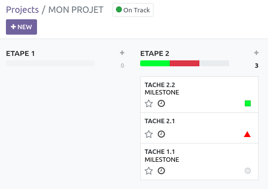

Customize Odoo / odoo / `project` module.

- Display entry menu "Project \> Configuration" for members of
  `project.group_project_user`.

- Give access to `project.project`, `project.tags` and
  `project.task.type` models for members of
  `sales_team.group_sale_salesman_all_leads`.

- Hide menu that gives access to `mail.activity.type`.

- Changes the display of the field ``kanban_state`` of the task (``project.task``)
  kanban views to make it colour blind friendly.

- Display the hidden field ``planned_hours`` of the model ``project.task``.
