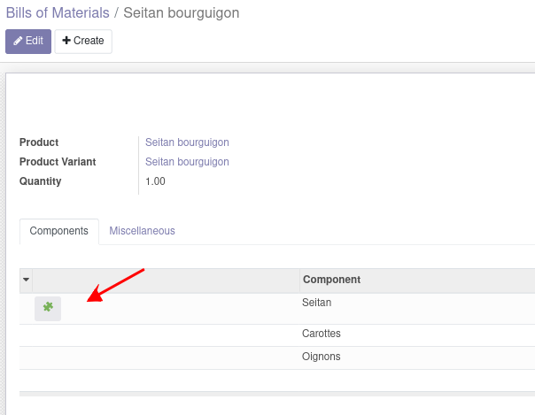

Add a shortcut button on Bom Lines of intermediate products (intermediate products are product that have BoMs).
The shortcut goes to products BoMs tree view or directly to the only BoM form view.

Example : in the food BoM "Seitan bourguignon-vegan", you have a intermediate product "Seitan" that have its own BoM.
https://www.lapetiteokara.fr/recette-10-seitan-bourguignon-vegan/

