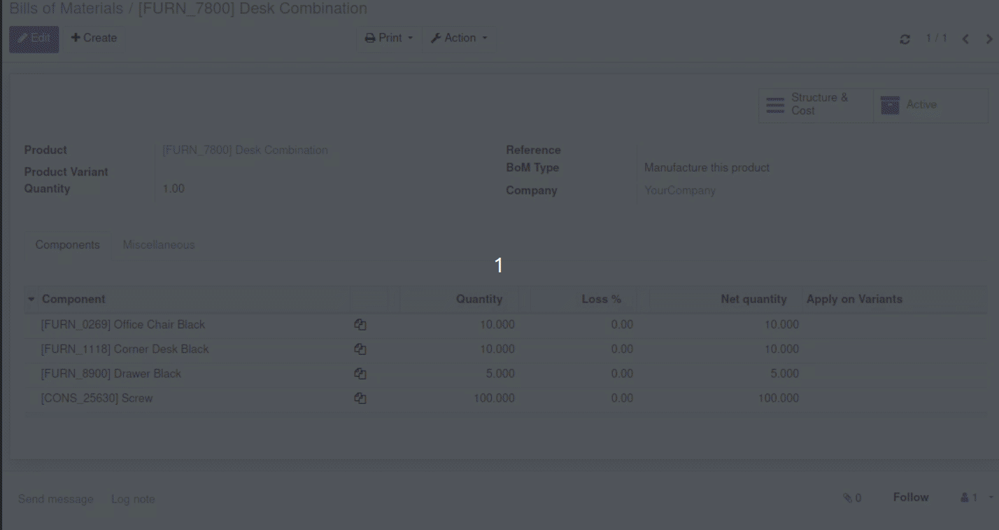

Handle gross and net quantity on BoM lines thanks to loss percentage
Fill quantity (original one is 'gross quantity') : it set automatically 'net quantity'
Fill loss percentage, Odoo will show two buttons to calculate net or 'gross quantity'
You can also set 'net quantity' and calculate 'gross quantity' with loss percentage

