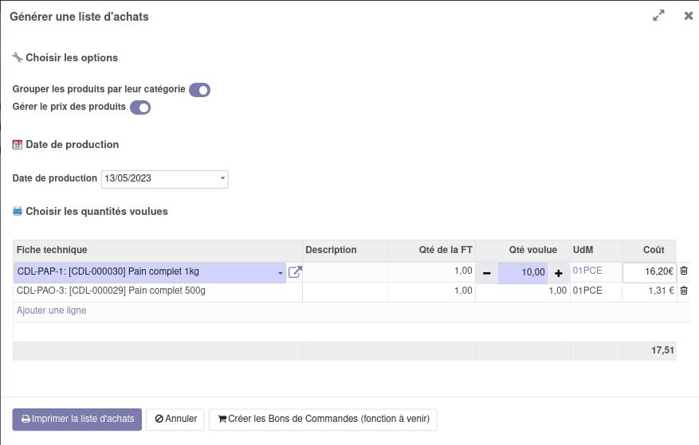

From Bill of Materials, handle the purchase of their components with wizard.
Print a PDF Purchase with three tables :
- reminder of quantities to prepare
- table of intermediate products to produce
- table of components products to purchase

You can choose some options : group products to order by category and/or display cost price.

.. figure:: ../static/description/bom_purchase_printing_with_options_pdf.png
