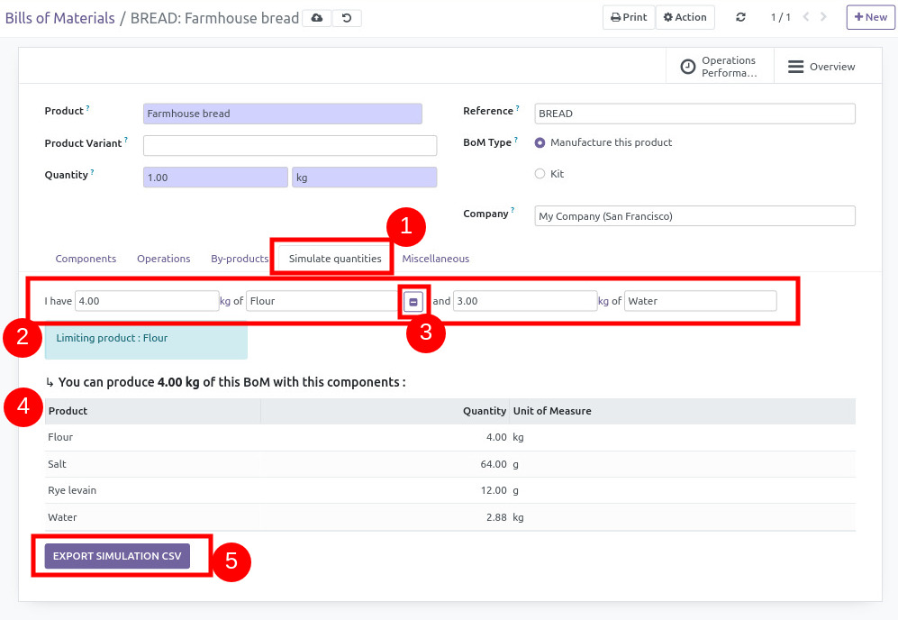

- The user goes to the dedicated tab
- Writes a component quantity I has
- Option : he can write a second quantity of a second product (or hide
  the option)
- Odoo calculates the components quantities and BoM quantity, showing
  the limiting product if the second product has been filled
- The user can export the BoM and BoM lines in CSV.

