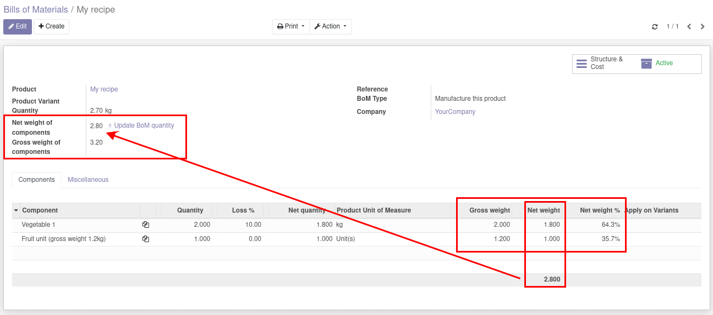

Useful for users managing weight in their product and bills of material.
Depends on mrp_bom_line_net_qty

Calculate BoM line weight :
- if product is a weightable product : weight is bom line weight
- if product is a unit product : weight depends on quantity and product weight and net_weight

Helps adjusting BoM quantity with net weight of its components.

