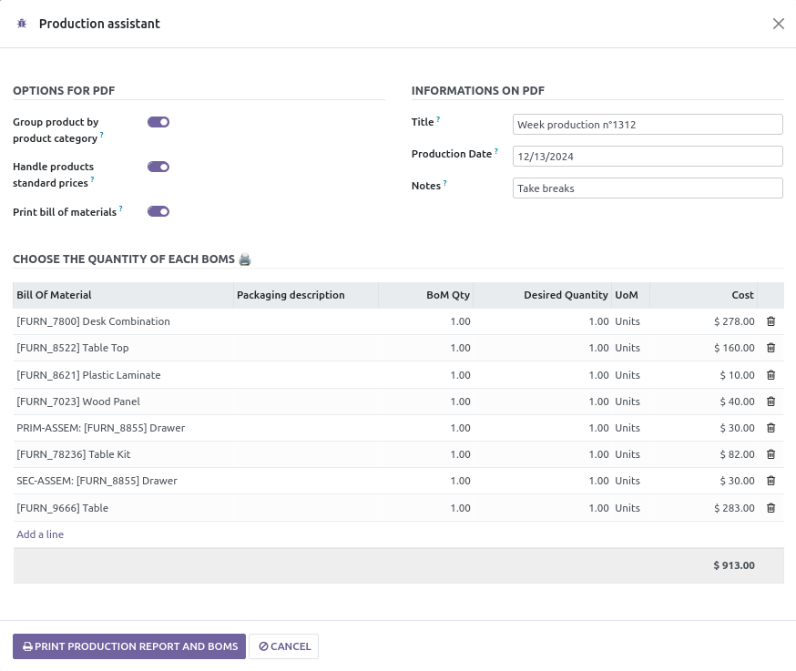
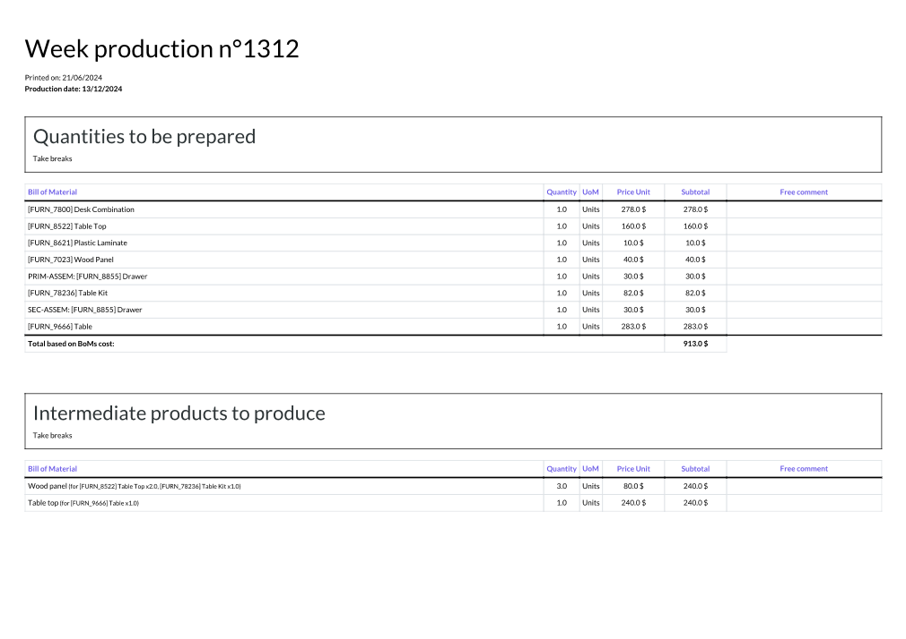
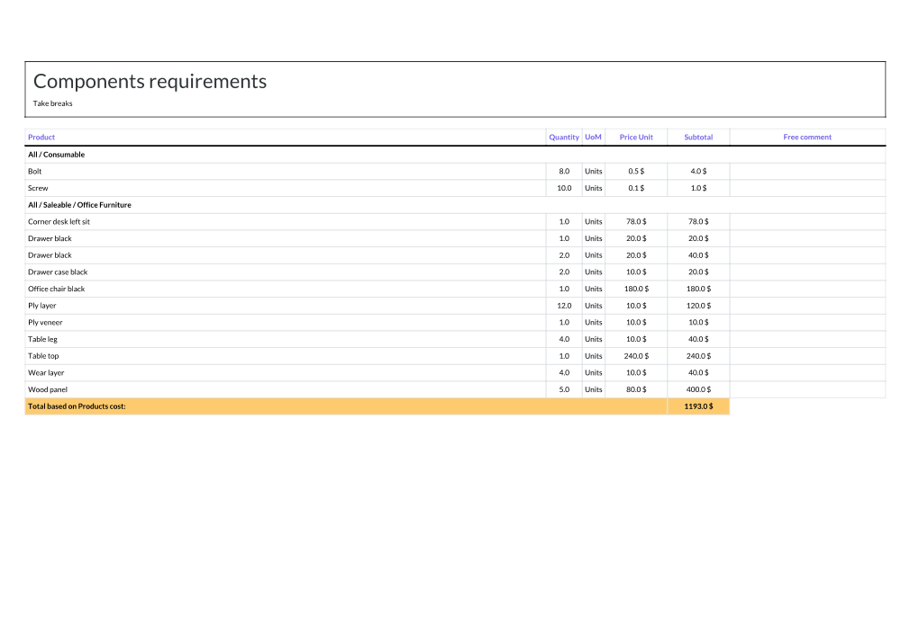
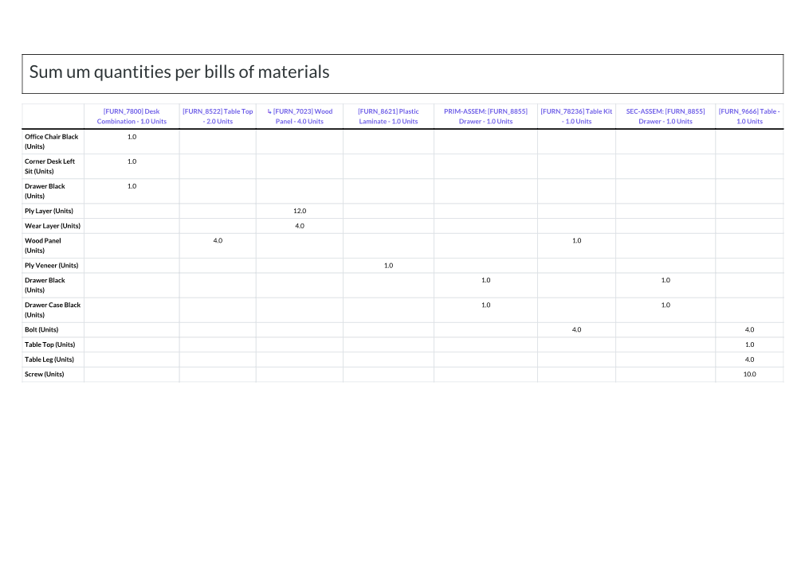
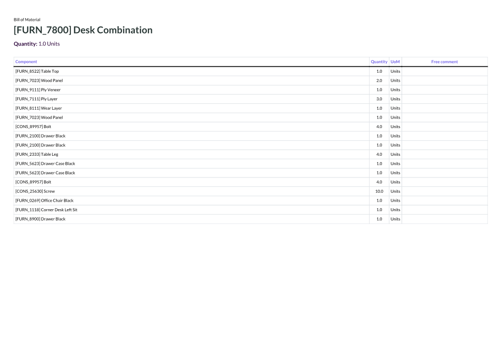

Users selects Bill of Materials and launch wizard.
Wizard permits to print a PDF Purchase with three tables :
- reminder of quantities to prepare
- table of intermediate products to produce
- table of components products to purchase

You can choose some options : group products to order by category and/or display cost price.

