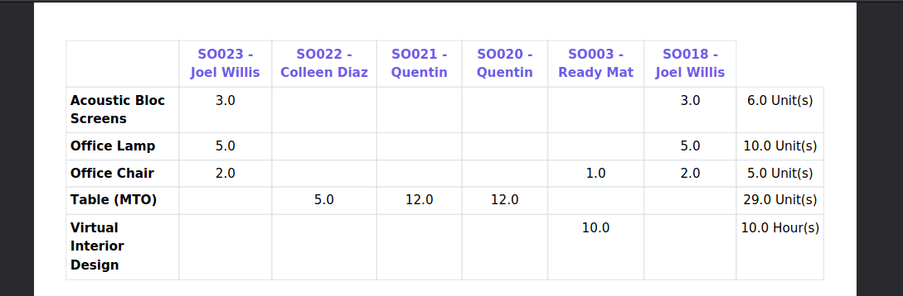

Quickly manage what you need to produce thanks to grouped sales

.. figure:: ../static/description/mrp_sale_grouped.png

1 : Create and name your production groupe
2 : Associate sales to this production group
3 : Retrieve sales and production order created thanks to this sales
4 : Adjust quantities with Matrix2D view
5 and 6 : Confirme sale orders one by one or all at once
7 : Print PDF that sum up sales by product and sale

