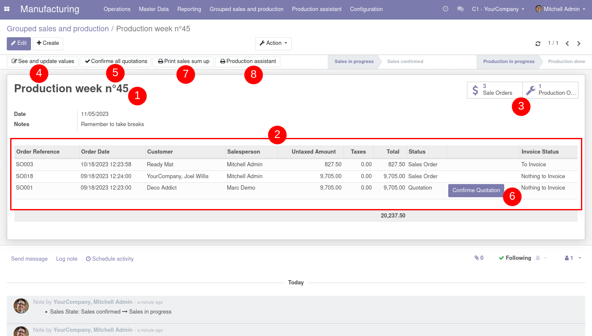

Quickly manage what you need to produce thanks to grouped sales

1 : Create and name your sale grouped sales
2 : Associate sales
3 : Retrieve sales and production order created thanks to this sales
4 : Adjust quantities with Matrix2D view
5 and 6 : Confirme sale orders one by one or all at once
7 : Print PDF that sum up sales by product and sale
8 : Handle your production with wizard assistant, you can handle what components
you have to buy, intermediate and finished products you have to produce.

.. figure:: ../static/description/report_sales_sum_up.png

.. figure:: ../static/description/production_wizard.png
.. figure:: ../static/description/production_wizard_report.png
