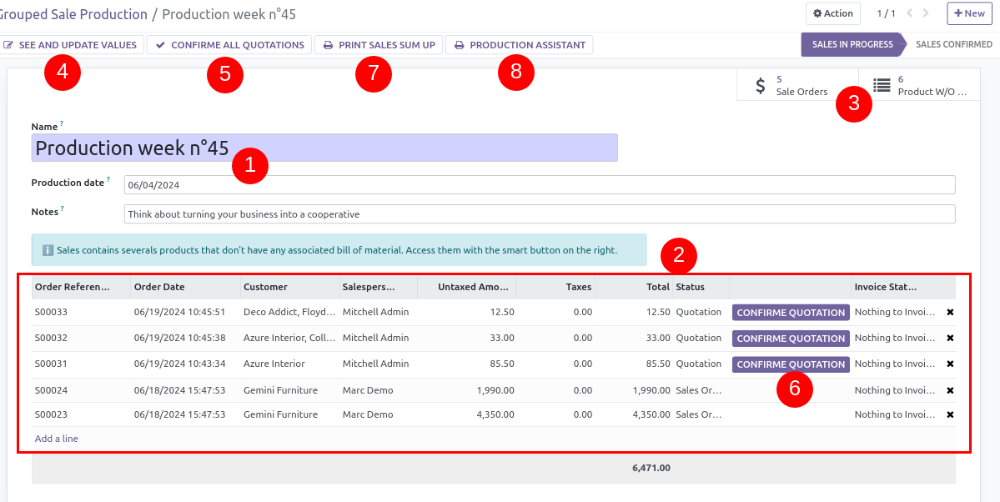
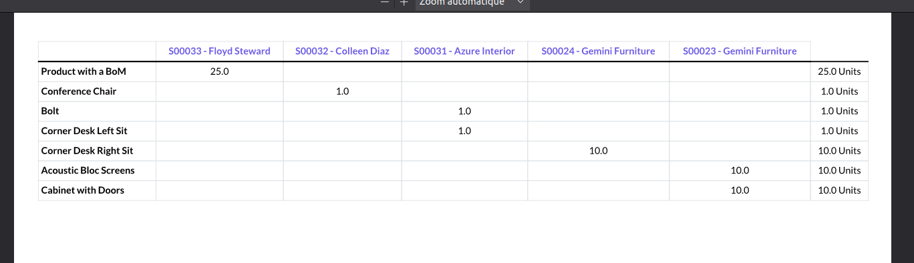
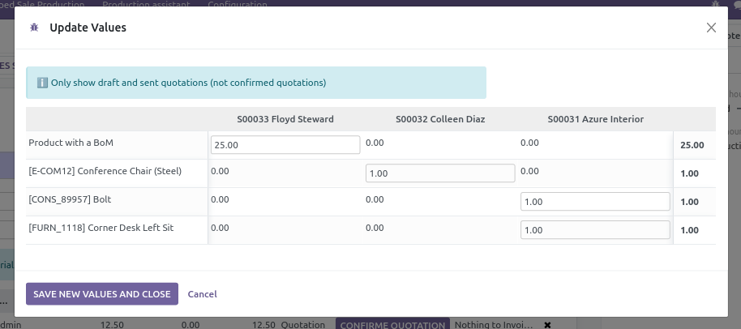
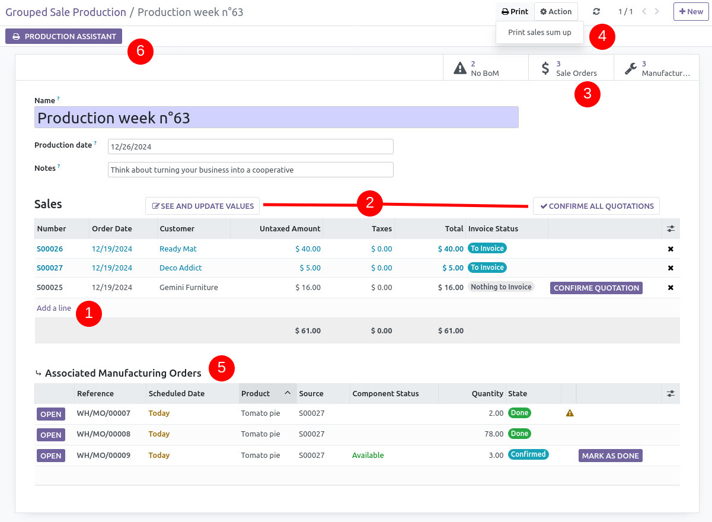

Quickly manage what you need to produce thanks to grouped sales

1 : Choose or create sales
2 : Act on sales : adjust quantities with Matrix2D view, and confirme
all at once
3 : Quick buttons : Products without BoM, Sales, Manufacturing Orders
4 : Print PDF that sum up sales by product and sale
5 : Act on Manufacturing Orders
6 : Handle your production with wizard assistant, you can handle what components
you have to buy, intermediate and finished products you have to produce.
See dedicated module mrp_wizard_production

