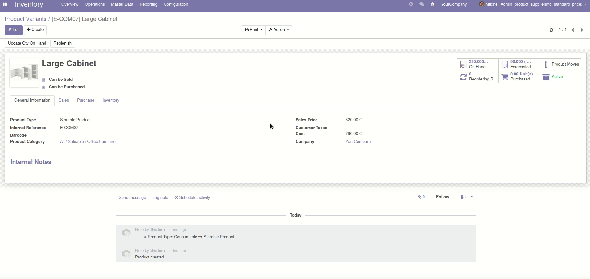

Product supplier easily connected to product's standard price.
Write your supplier informations in your product form.
Then you can choose one of this supplier info for the product's standard price.
Use web_notify to alert user.

