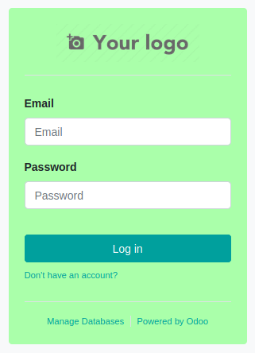
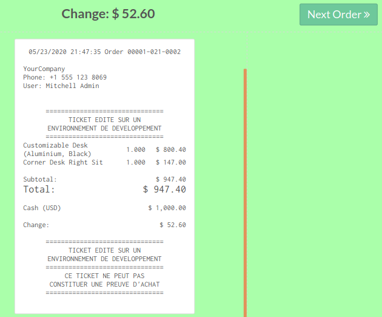

This module is a custom module for GRAP, using ``server_environmnent`` OCA
modules.

It adds two settings, depending on the environment :

* Custom css to clearly distinguish which server you are acting on

* messages on the PoS Bill if the server is a non production server

